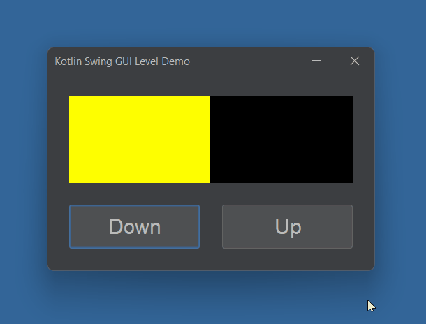

# Kotlin GUI Level Meter Demo

This is a demo showing how a Kotlin / Swing GUI app can show a graphical representation of a value in the app model data.

A panel is placed within another container / back panel, and resized based on the data value.

